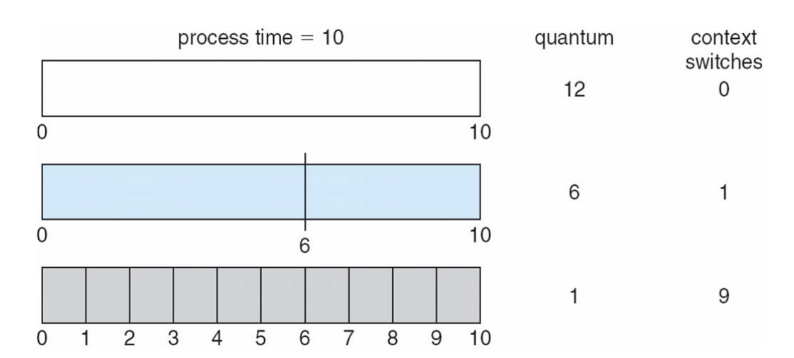
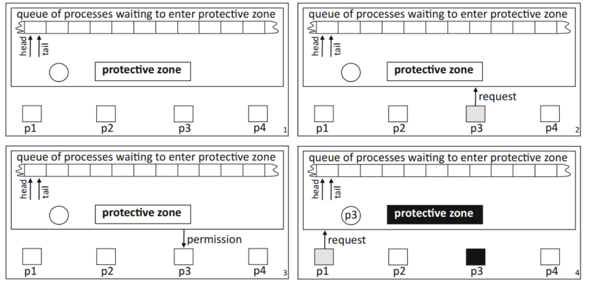

# 基本概念

## 操作系统定义

操作系统是用户和硬件的中介(intermediary)，二者紧密相连，内核是操作系统的核心控制块。

**1.可以使硬件更方便地被使用**

**2.管理系统资源(时间和空间)，程序执行时所需的时间和空间，然而有的时候会出现冲突的目标，比如：最大化程序的吞吐量以及最小化响应时间**


操作系统也可以表述为**用户应用程序和硬件之间的软件层**，**通过硬件接口抽象硬件，隐藏了运行时的大量细节**。


## CPU

基本的硬件资源有：

+ CPU：同一时间只有**一个进程**会在CPU上运行，一秒钟能运行数亿条指令，是最宝贵的资源，控制系统中所有的事物

+ Memory：容量有限，**临时**存储，是一种电子存储设备速度非常快，**所有运行在CPU上的程序必须在内存中**。

+ Storage(Disk)：近乎无限的容量，**永久**储存，速度较慢，是一种机械装置，所有的数据以**块**为单位访问

+ I/O：**Disk/SSD**属于I/O子系统，它们与CPU和内存的交互需要通过I/O总线


CPU的指令集：CPU**能执行的指令集合**，对于不同的CPU**架构**，其所对的指令集也**不同**，不过基本上都有**load和store**指令，用于在寄存器和内存之间传递数据。


CPU寄存器：

通用寄存器，General Registers，**用于储存关键变量和临时结果**

特殊寄存器包括有：程序计数器(PC)——**存储下一条将要执行的指令的地址**，指令寄存器(Instruction Register, IR)——**存储当前正在执行的指令**，处理器状态字(Processor Status Word, PSW)——**包含CPU运行状态的各种控制位，如模式位**


操作系统会将程序加载到**内存**中，并将内存地址存放到**PC**中，CPU会**取得，解码，执行指令**，然后根据PC获得下一条指令。


## 双模式

双模式操作 是操作系统用于保护和安全的重要机制之一，它允许计算机区分**用户模式（User Mode）**和**内核模式（Kernel/Supervisory Mode）**，以确保用户程序不会直接访问关键系统资源，从而保护操作系统的稳定性和安全性。


用户模式：**运行所有的用户应用程序，受限访问，只能执行基本的指令不能操作硬件( I/O 设备、内存管理)，如需访问受限资源需向操作系统请求服务(system call)**

内核模式：**具有完全的权限**，只能在内核模式下运行的指令称为**特权指令**，这些指令一般会影响整个机器，包括**读取/设置时间，读取文件，访问打印机**。

**用户永远不要在内核模式下操作**

 

## shell

命令行解释器(Command Interpreter)，它接收用户**输入的命令**，**解释并传递给操作系统执行**，最后将执行结果**返回**给用户。

用户所键入的命令并不是操作系统的一部分，而是利用了系统调用的，独立的**可执行二进制文件**


shell特指正在**运行着的**命令解释器进程，**运行机制**大体上如下


当执行命令时会创建一个**子进程**来运行该命令，**对于简单的命令，shell会等待子进程结束**

使用**&**命令，shell不会等待进程结束，而是可以继续接受新的命令


# Linux操作

## 目录

+ / 根目录：所有目录挂在其下
+ /boot：存放Ubuntu内核和系统启动文件。系统启动时这些文件先被装载。
+ /etc：系统的配置文件目录。密码文件、设置网卡信息、环境变量的设置等都在此目录中，许多网络配置文件也在其中。
+ /lib ：根文件系统目录下程序和核心模块的共享库。这个目录里存放着系统最基本的动态链接共享库，类似于Windows下的system32目录，几乎所有的应用程序都需要用到这些共享库。
+ /media ：主要用于挂载多媒体设备。ubuntu系统自动挂载的光驱、usb设备，存放临时读入的文件。
+ /proc ：这个目录是系统内存的映射，我们可以直接访问这个目录来获取系统信息。也就是说，这个目录的内容不在硬盘上而是在内存里。
+ /sbin ：s就是Super User的意思，这里存放的是系统管理员使用的系统管理程序，如系统管理、目录查询等关键命令文件。
+ /tmp ：这个目录是用来存放一些临时文件的，所有用户对此目录都有读写权限。
+ /home ：用户的主目录。下面是自己定义的用户名的文件夹。每个用户的设置文件，用户的桌面文件夹，还有用户的数据都放在这里。
+ /mnt：此目录主要是作为挂载点使用。通常包括系统引导后被挂载的文件系统的挂载点。如挂载Windows下的某个分区。

​		


## 指令

+ ls 列出目录内容 -l显示详细信息(简写为ll)，-a包括隐藏文件
+ pwd输出当前位置
+ cd 切换目录
+ ps查看系统中的进程信息 ps -el显示完整信息
+ rm name 删除文件(\*删除所有*) -f强制删除不确认 rmdir删除空目录
+ mkdir directory_name创建目录
+ uniq 过滤重复的结果 
+ cat filename显示文件内容(可以同时显示多个文件内容) cat>filename覆写文件内容（追加用>>），如果文件不存在则创建，使用ctrl+d退出编辑


​	cat file1 file2 > file3将前两个文件的内容合并到第三个文件中，同样是不存在则创建，存在则覆写


+ echo输出文本到终端 echo “text”

+ cp复制文件或目录，cp file1.txt /home/user/documents/复制文件到目录下，cp -r dir1/ dir2/复制一个目录的所有内容到另一个目录下。


+ mv用于移动或重命名文件，mv oldfile.txt newfile.txt重命名(新名称存在就覆盖)，mv file1.txt /home/user/documents/移动到目录，mv oldfile.txt /home/user/documents/newfile.txt移动到目录同时重命名。


+  wc filename 输出文件中的行数，词数(空格分割)，字符数  wc -c filename只输出字符数 wc -l filename只输出行数


+ sort filename 排序文件内容，以行划分字符串按升序进行，sort -r filename倒序


+ chmod xyz filename 设置文件的权限：x,y,z设置所有者}所属组|其他的权限，数字表示法的话是r-4 w-2 x-1分别是读|写|执行，chmod 755 file.sh 的含义是`rwx`（所有者），`r-x`（组），`r-x`（其他）。


## I/O重定向

每个进程启动时，通常会**自动拥有三个标准文件描述符012**，分别用于**输入stdin**，**输出stdout**，和**错误输出stderr**

在shell中可以通过**I/O重定向**，让程序的输入输出不在依赖默认的屏幕和键盘，而是文件


相当于程序 `a.out` 中 `scanf`、`cin` 等读取的不是键盘输入，而是 `input.txt` 里的内容，此时键盘输入不生效

```shell
./a.out < input.txt
```

结果输出到文件中

```shell
./a.out > output.txt
```


将错误信息存入文件中

```shell
./a.out 2> error.txt
```


同时修改输入输出和错误文件

```python
./a.out < input.txt > output.txt 2> error.txt	
```


dup函数使用**当前最小的可用文件描述符**指向和**oldfd**相同的**文件**，文件**偏移量**以及文件**权限**(如果失败，则返回**-1**)，函数会返回该**文件描述符**。

```python
int dup(int oldfd);
```


每个进程都有自己的**文件描述符表**，当新打开一个文件时**会添加一个表项**，子进程被创建的时候会**复制**这张表。


如下图所示：首先**打开**一个文件描述符，随后**关闭标准输出**(0标准输入，1标准输出，2标准错误)，通过**dup(fd)**将标准输出定向到文件，因为此时**最小的可用文件描述符是标准输出**，dup的返回也就是标准输出，这里不需要接受返回值，至此将**标准输出定向到了文件**，最后**关闭原来指向文件的描述符**。


dup2(oldfd,newfd)相较于dup，**可以指定将oldfd复制给谁**，因此不需要预先关闭newfd


## exec

exec代表**一组**可以替换当前进程的系统调用，它不会**创建**新的进程，而是用**新的程序替换当前程序的数据和代码**。注意**PID**，**PPID**和**已经打开的文件描述符**会保留。


当调用该`exec` 族函数时：

1. **关闭当前程序的代码和数据，当进程的PID不变**
2. **加载新程序**
3. **执行该程序并且不会返回，如果调用失败会返回-**1


p使用**相对路径**，不加p则是**绝对路径**，e则是**自定义环境变量**，不加p则需要传入**完整的路径**。

**l**和**v**表示**参数的传递方式**，前者**一个一个列举**，后者使用**数组**，二者都需要用**NULL**结尾。

注意参数(不包括)中的第一个是**程序名**。


```C++
// 枚举传参
execl("/bin/ls", "ls", "-l", NULL);

// 列表传参
char *args[] = {"ls", "-l", NULL};
execv("/bin/ls", args);

execlp("ls","ls","-l","a.c",NULL);
```


## 管道符

管道符的作用和管道一样

**| 管道符可以将两个命令分开，左边的命令的输出作为右边的命令的输入**，可以**连续使用**即第一个命令的输出会作为第二个命令的输入，第二个命令的输出又会作为第三个命令的输入，依此类推。


将三个文件的内容排序后输出到打印设备，在后台执行

```bash
 cat file1 file2 file3 | sort  >/dev/lp &
```

# 进程

## 进程

进程process是**运行的程序**，程序不过是储存在磁盘中的**一堆指令**，当它被加载到**内存**中时便**成为了一个进程**。


所有的进程都是**init进程**的子进程	


进程有一个**程序计数器(**Program Counter)用于**追踪即将执行的下一条指令**，同时每个进程都有自己的**地址空间**(进程在运行时可以访问的地址区域)


进程被**进程标识符(pid)**标识


注意下图只是一个演示，这些段在物理内存中的位置**可能不连续**，但操作系统通过**虚拟内存管理**，会将这些分散的段映射到进程的虚拟地址空间，使得进程**认为自己的内存是连续的**。


进程的空间可以划分为

+ 代码段：**存放可执行程序的指令代码，可共享对于频繁使用的程序只需在内存中保留一个副本，通常是只读的防止被修改**
+ 数据段：**存放已初始化的全局变量和静态变量**
+ 堆：由 `malloc`、`calloc`、`realloc` 等**动态分配函数申请**，存储动态分配的内存，**向高地址增长，大小可变**

+ 栈：**存放函数调用相关信息(其中有局部变量)，向低地址增长**


多次调用相同的程序会创建**不同**的地址空间


## 僵尸进程

僵尸进程指**子进程已经终止，但父进程未回收其退出状态的进程。**而孤儿进程**orphan**指的是父进程未等待子进程就结束。 


形成过程如下：

1. **父进程调用fork创建子进程**
2. **子进程结束任务后调用exit()终止，进入终止状态(Terminated State)**
3. **此时子进程的状态还保留在PCB中，当子进程退出时，系统不会立即清空它的PCB而是保留其退出状态，直到父进程调用wait进行回收**
4. **如果父进程未调用wait回收资源，那么子进程的资源是不会被释放的**


**top**指令会显示进程的信息。


## PCB

PCB 进程控制块，每个进程都会有一个对应的PCB，它是**内核中储存进程信息的数据结构**，一般存放在**内核空间**中而不是进程的地址空间防止被用户操作


它包括的信息有

+ 进程标识符
+ 处理机状态：通用寄存器，PC，PSW，用户栈指针
+ 进程调度信息：进程状态，进程优先级，进程调度所需的其他信息(调度算法)，事件(阻塞原因)
+ 进程资源：内存空间，打开的文件


## 进程切换

下述是进程运行的状态图，suspend状态见schedules


+ New: **进程首先被创建，还未被操作系统接收**
+ Ready: **进程已分配资源但尚未执行，等待CPU调度(Dispatch)**
+ Running: **进程在CPU上运行**
  + Timeout超时: **进程被剥夺CPU，回到Ready队列**
  + Event Wait等待事件: **进程进入Blocked（阻塞）**
  + Release释放: **进程执行完毕进入Exit终止状态**

+ Blocked: **等待某个事件完成**
+ Exit: **进程执行完毕，操作系统释放其资源**


**每种状态都会维护一个队列，其中运行状态的队列大小为一**

实际上队列中存储的是**进程的PCB**


如下所示，**操作系统调度也要耗费时间**，这段时间中系统不会做有用的工作，越复杂的OS和PCB，切换所需的时间也就越长。


**进程切换(context switch)**指的是**操作系统暂停当前正在运行的进程，保存它的状态，并加载另一个进程的状态使其继续运行。**一般发生在**进程等待I/O，或者运行了一段时间的时候**。


假设要从进程A切换到进程B，过程如下：

+ 保存A的**上下文context**到**PCB**，包括PC，CPU寄存器内容，堆栈指针，PSW
+ 更新进程状态，将PCB**插入到ready或者waiting队列中**
+ 运用调度算法选择下一个要运行的进程，即B
+ **加载B的上下文**到CPU中
+ **将新进程的状态改为Running，CPU将控制权交给B，B从上次中断的地方继续运行**


## 子进程

通过fork可以创建一个和父进程有**相同状态**的子进程(子进程也会有自己**不同的资源**，比如pid)，但该进程拥有自己**独立的空间**

子进程继承父进程的**文件描述符(表)**(注意不是拥有**同一个**)，即共同操作文件，对同一文件的写入**不会被覆盖但是顺序不确定**；子进程从**fork的下一行**开始执行，如果父进程**重定向了输出**，那么fork出的子进程的输出也同样会被重定向。


父进程和子进程的执行顺序是**不确定**的。


在一些操作系统中，为了防止僵尸进程的出现，当父进程终止时，**它的子孙进程也会跟着终止**，这是由**操作系统**完成的。


**fork()会返回两次，子进程会获得pid=0，父进程会获得子进程的标识符**，如果失败(一般是达到可以创建的进程**上限**)会返回**-1**


**getpid()返回进程的PID getppid()返回父进程的PID**


父进程需要等待子进程结束，**PID=wait(int *statue)**将**阻塞**程序直到**任意**子进程**结束执行**或者**发送中断信号SIGINT**，它会返回**已退出的子进程的PID**，如果不存在子进程则会返回**-1**，其中**statue**会储存进程的**返回状态**，传入**NULL**表示不储存。waitpid会等待**指定的进程**结束。


有时，父进程通过 **`abort()` 系统调用**主动终止其子进程，原因如下

- **资源超限**：子进程超出分配的资源（如内存、CPU时间）。
- **任务失效**：子进程的任务不再需要（如用户取消操作）。
- **父进程退出**：某些系统不允许子进程在父进程终止后继续运行（孤儿进程会被清理）。


**操作步骤**：

1. 父进程调用 `abort()` 发送终止信号。
2. 操作系统立即终止子进程，并回收其资源（可能不保留状态信息）

## 进程间通信

IPC指**进程间通信**，有三种方式：管道(半双工)，共享内存(全双工)，套接字，消息队列


1. 单工：只支持数据在一个方向上传输

2. 半双工half-duplex：**允许数据在两个方向上传输，但同一时间只允许在一个方向上传输**

3. 全双工full-duplex：**允许数据同时在两个方向上传输**


管道分为匿名管道和命名管道，管道实际上是**内核的一块缓存**(大小有限，操作系统内核专门用于临时存放数据的一块区域)，它按照先进先出**的方式处理数据，操作系统会**协调进程间的同步**，确保写入和读取的顺序匹配，不会发生数据混乱。


+ Ordinary Pipes(anonymous pipes)：**只能在父子进程中通信(只要满足有公共祖先)，数据是单向的，不能被其他进程访问。**

+ Named Pipes：**允许**任意进程**进行数据交换**，需要文件系统支持。


+ 当向**已满**的管道写入数据时，系统会**阻塞**程序，直到管道有**足够的空间**
+ 从**空的**管道中读取也同样会**阻塞**。
+ 如果一个进程**打开管道用于读取**，而没有进程**打开管道写入(提前关闭)**，读取进程会被一直**阻塞**，即管道需要**匹配**。


当写端关闭，读端会读取到**0**，表示EOF。反之，write()会返回**SIGPIPE**信号，如果忽略信号则 `write()` 返回 `-1`，`errno` 设为 `EPIPE`


socket——**不需要进程间的关系，可以在不同机器之间通信**。


共享内存是**最快**的通信方式，因为进程**直接**对内存进行存取，多个进程可以同时操作，需要信号量同步。管道由于位于内核态，所以存取要先进入内核态，存在上下文开销，速度较慢。

# 线程

线程是CPU**资源分配和执行**的**最小**单位(CPU utilization)。


同一进程内的多个线程**共享内存空间**(代码段**Text**，数据段**data**，堆**heap**，文件描述符**open files**，**sockets**，**lock**...)，但每个线程都有独立的**栈，SP，寄存器状态和PC**，使得它们可以**并发**执行，线程奔溃会影响到整个进程。


**传统**的进程是**单线程模式**，即一个进程只包含一个线程，拥有独立的空间


线程的优势在于：

+ **更快的创建/结束**
+ **更快的切换(上下文更少)**
+ **线程可以共享资源，它们之间的通信不需要使用内核**


因此线程被称为**轻量级**进程(lightweight process)，如果应用要执行一堆**相关联的操作**时，使用多线程更有优势。


进程**创建**所需的时间和资源比线程**昂贵**，但是有着**更快**的**响应速度**，以及**安全性**(一个任务的崩溃不会影响到别的任务)


多线程模式中，通过**TCB**（线程控制块）管理线程信息，其**存储线程的运行状态，栈，PC，SP，寄存器的值，errno**


线程没有**挂起**swap操作


线程可以**创建线程**，线程之间没有**依赖关系**


```C
#include <pthread.h>
int pthread_create(pthread_t *thread, const pthread_attr_t *attr, void *(*start_routine)(void *), void *arg);
```

+ thread指向该线程的指针
+ attr指定线程的属性，可以传入NULL指定默认属性
+ start_routine线程创建后要执行的函数，需要返回void类型
+ arg传给函数的参数，一般用结构体
+ 成功则返回0


线程也有**唯一的标识符**，可以通过**pthread_self()**得到


注意**Main**函数本身就创建了一个线程


**pthread_join**阻塞当前线程直到目标线程结束，目标线程的退出状态存到retval中

注意传入的是指针而不是标识符

```python
int pthread_join(pthread_t thread, void **retval);
```

返回0，成功


线程有三种实现方式

User-Level Threads, ULTs

+ **内核不知道线程的存在，只看到单线程的进程，这些线程一般通过线程库(POSIX)创建**
+ **每个进程维护自己的私有线程表，记录每个线程的信息——PC，SP，寄存器值，线程状态..**
+ **线程的切换不需要内核模式，因此更快**
+ **如果一个线程阻塞，整个进程都会被阻塞**


Kernel-Level Threads, KLTs

+ **线程的创建和销毁都是通过系统调用完成的**
+ **内核维护全局的线程表**
+ **一个线程阻塞，其他线程仍能执行**
+ **线程开销更大**
+ **调度是基于线程的，而不是进程(fine-grain精密)**


混合线程实现(**Hybrid**)

+ **将用户级线程嫁接到内核级线程上**


# 调度

调度器是操作系统的一个关键组件，负责管理和分配CPU时间给不同的进程或线程

CPU调度的目标：

1. 共享时间，保证公平
2. 防止饥饿
3. 提高CPU利用率
4. 降低开销
5. 调整进程优先级，保证关键任务按需执行


## 基本概念

操作系统中主要有以下几种队列：

+ 作业队列：储存**所有未进入主存的进程**，位于磁盘上

+ 就绪队列：储存**所有已经在主存上，等待CPU执行的进程**，位于主存中

+ 阻塞队列：储存**等待某些事件而暂停执行的队列**，位于主存中

+ 挂起队列：挂起的进程队列，位于磁盘上


调度器类型：

+ 长期调度器：也称作业调度器，它从池中选择进程并将它们保留到主存的就绪队列中，长期调度器的的目的是在池中的选择IO密集型和CPU密集型进程的完整组合。如果作业调度器选择的是更多IO密集型进程，则所有作业都可能一直停留在阻塞状态，而CPU将大部分时间处于空闲状态。这将降低多道程序设计的程度。
+ 短期调度器：也称CPU调度器，从就绪队列中选择一个作业并将其分配到CPU中执行
+ 中期调度器：负责交换，比如换出发送I/O请求的进程，为其他进程释放资源


进程分为：

+ **I/O密集型：**大部分时间进行**I/O操作**，占据CPU时间**较短**，频繁但短暂的**CPU突发**，即每次使用CPU时间**较短**，然后因**等待I/O**而阻塞
+ **计算密集型：**花费大部分时间**计算**，长时间占据CPU


CPU进程调度的方式，主要分为非抢占式和抢占式两种调度方式。

+ 非抢占式：一旦把处理机分配给某个程序后，就让其**一直运行下去**，只有当进程**完成**或者发生**事件阻塞**时才会把处理机**释放**给其他进程。
+ 抢占式：允许高优先级的进程随时抢占正在的运行的低优先级进程的CPU时间


## 调度算法

调度可以选择赋予进程优先级来选择下一个要运行的进程，优先级的分配方式分为**动态与静态**。但有的时候一些低优先级的进程会遭遇**starvation**因为高优先级的进程不断出现。


### FCFS

First-Come, First-Served (**FCFS**)

在FCFS的模式下**同时**到达的三个进程p1=24,p2=3,p3=3，以p1,p2,p3的顺序运行所需时间如下：


如果执行顺序为 P2 , P3 , P1，则有


因此如果存在**长作业位于队首**时会导致**平均等待时间**较大，比如CPU密集型后跟多个I/O密集型，因为I/O密集型所需的**CPU时间较短**。


Last-In First-Out(LIFO)可能会导致starvation


### SJF

Shortest-Job-First (SJF)**最短作业优先**

每个进程都关联一个**估算的CPU burst time(这也是难点)** ，调度程序会选择进程中**最短**的运行(最短的回跳到**队首**)，这种方式可以**最小化平均等待时间**。batch jobs(**定期、重复执行**的任务)的运行时间很**容易**估算，交互式进程(Interactive processes)需要**统计**方法来估计


### RR

轮转调度，每个进程都会被分配一个**固定的时间片**，如果进程**未在时间片内完成**则会触发时钟中断，进程会被暂停，并放入Ready queue**末尾**。

如果有n个进程，时间片为q，每个进程会获得**1/n**的CPU时间且**最多运行q时间**，然后进入到队列末尾(未运行完)，每个进程最多等待**(n-1)q**时间。


如果q太大，会变为**FIFO**模式，太小会频繁地**context switch**增加开销


对于q=4的图如下所示


通常平均周转(turnaround)时间比sjf**大**，但是**响应时间更好**。 


注意**切换次数**的计算不是做除法




可用于优先级调度结合——对于**相同优先级**的进程执行RR，如果当前优先级只有自己那么**一直运行**下去


### Multilevel Feedback Queue Scheduling

在多级队列模型中，系统会把不同类型的进程分配到不同的队列中，队列之间的调度顺序有两种：**固定，时间片**

多级反馈队列调度，划分有**多个队列**，每个队列有**不同的优先级**，队列中的进程优先级都**相同**


进程可以在队列之间**切换**

1. **新来**的进程都会赋予**最高优先级**
2. 如果进程在**规定的时间片**内完成，则直接**退出**，反之**降级**
3. 在第一级队列**空了**的时候才会执行第二级队列中的进程


### lottery scheduling

一种**随机化**的调度算法

每个进程都会获得一定量的**lottery tickets**，票数越多被调度的概率就越大，调度器计算所有的彩票总数，然后**随机选择**一个号码，持有该号码的进程会被调度。


# 异常

定义：由于**处理器状态变化**而导致**控制流发生突然改变**的情况，这里介绍的是**操作系统的异常**而非程序语言中的异常。

异常分为两大类：**同步异常(Synchronous)和异步异常(Asynchronous)**，前者由指令引发，发生时机可预测

同步异常包括：**除0，请求I/O，请求更多的堆内存**，**访问受限的内存**（如访问内核地址，越界），**访问尚未加载到内存的变量**(虚拟内存)

异步异常包括：**键盘输入，磁盘完成数据读取**


异常在某些方面类似于函数调用：

+ **控制流转移**
+ **执行处理代码**


区别在于：

+ **函数调用只保留返回地址，而异常会保留所有寄存器的值**

+ **异常会将数据压入操作系统栈而非应用程序栈，**
+ **异常的处理程序在内核模式下运行**
+ **异常可能会返回到当前指令，或者不返回，而非一定返回到下一指令**


异常有四种类型：Interrupts，Traps，Faults，Aborts


Interrupts由外部设备触发，例如键盘输入会发送中断信号给CPU，磁盘读取完成后通知CPU，属于异步异常

Traps由程序主动触发的异常，通常用于请求操作系统服务，例如请求I/O或者堆内存

Faults是可以恢复的异常，比如访问受限内存，虚拟内存

Aborts是无法恢复的异常，程序会直接崩溃，比如过热


发生中断时，处理器会设置PC**指向中断处理程序的起始地址**，并从**用户模式切换到内核模式**，处理中断的程序可以执行**特权指令(因为切换到了内核态)，切换回来时会重新设置PC**。

**TRAP指令**会让CPU**从用户模式切换到内核模式**，**用户进程的状态会被保存**，在操作系统执行完处理程序后，**会恢复进程的状态**，然后执行用户模式。

# 轮询和中断

轮询polling——**CPU定期检查设备的状态以确定是否需要数据传输**，一般是通过读取设备状态寄存器来判断，类似于时不时查看手机确定时间。


Interrupt**允许设备在需要CPU时主动通知CPU，而不是由CPU定期检查**。


每个设备都会有一个**中断线(interrupt line)**，**用于在数据完成传输时通知处理器**，当中断信号触发时，处理器执行**中断处理程序**，没有设备需要服务时则不会有**额外的开销**。

CPU中有一个包含**每个设备类型的表**，表中存储着与设备有关的**中断处理程序的入口地址**，每当CPU收到中断信号时它都会**查找**表，找到对应的程序入口地址然后执行。


大多中断程序使用汇编语言写的，因为**高效**。

# 系统调用

系统调用：**内核提供给用户程序的接口，用于访问内核功能(文件读取，进程管理，文件管理，网络通信)**，只有通过**软中断**进入内核态才能使用，实际上系统调用就是函数调用不过调用的是内核态的函数。


系统调用分为三大类：**文件操作，进程管理，信息管理**


系统调用的过程：

+ 保存进程的**上下文**(到PCB或者内核栈中)，因为切换到内核态相当于切换了一个场景
+ 系统调用有唯一的**系统调用号**(kernel code)，用于指定内核态中对应的处理程序，它和其他参数存放到寄存器中，**传递给内核态**
+ 执行read()函数内部的**中断指令**，切换到内核态
+ 通过系统调用号找到对应的**内核函数**，读取参数并**执行**，处理的**结果**也会放到寄存器中
+ 返回到用户态，**恢复**原来的用户态寄存器、用户栈和PC


**POXIS是一组标准，规定了API，使得应用程序可以在不同的UNIX系统上运行。**

# 竟态

当程序的执行结果依赖于多个线程之间的**精确的执行顺序**(共享资源，执行影响结果)时，就存在竟态条件race condition


考虑如下代码

```C
char chin, chout; // 全局变量

void echo() {
    do {
        chin = getchar();
        chout = chin;
        putchar(chout);
    } while (...);
}
```

当多个线程运行此程序时，可能出现A读取了一个字符到chin中还没来得及输出，B就将chin**覆盖**


```C
void echo() {
    char chin, chout; // 局部变量
    do {
        chin = getchar();
        chout = chin;
        putchar(chout);
    } while (...);
}
```

即使改为局部变量也不能保证正确输出，因为多个程序**尝试输出**导致顺序不确定


在汇编语言中，x=x+1会被如下方式执行


这个过程中可能发生竟态


想要避免竟态，关键在于将指令成组执行，避免线程之间过度交错(interleaving)，从而划分**关键区域**。

关键区域是**同一时间只能被一个进程/线程执行的部分**


implementation0 

+ A进入关键区域后关闭所有的**interupts**，离开时重启中断
+ 只适用于**单核**
+ 不应该给用户**中断**的能力


**原子操作**——操作不能被**中断**或被其他线程看到中间状态


实现互斥的几种方法：


监督服务器：

+ 进程在访问共享资源之前，先向服务器发送**请求**
+ 服务器根据当前状态判断是否允许访问，如果资源被占用——拒绝(**refusal**)并把请求者放入**等待队列**，反之发送**许可**(permission)
+ 进程使用完资源后向服务器发送**释放信息**，服务器接收到信息后从**等待队首**取出下一个进程，授予其访问权




多路访问协议MAC

+ 单一共享广播信道，多个设备通过**一个信道**发送数据，Single shared broadcast channel
+ 如果两个或多个**同时**发送数据，会发生Collision，数据可能**丢失**
+ 三种常见的多路访问协议
  + **Channel Partitioning**， 信道会被分为多个小片段，时分/频分/编码(code)
  + **Random Access**，信道不预先划分，设备随时尝试发送。ALOHA，CSMA，CSMA/CD
  + **Taking Turns**，轮询，令牌传递


CSMA/CD

+ **发送之前先监听**，如果有节点正在发送那么就**等待**

+ Collision Detection冲撞检测，一**边发送一边检测**，如果有节点也在发送(接收到的数据不同) 则**停止**并发送噪声信号J**amming Signal**

+ 发生冲突后等待一个随机时间(**Randomness**)，使用**二进制**指数退避，注意时间不必是2的幂次


Peterson’s Solution

+ 限制在**两个进程**
+ 假设**LOAD**和**STOR**是**原子性**的
+ 两个进程共享**int turn**(指定谁先进入临界区)和**int flag[2]**\(初始化为False)
  + flag[0] = true implies that process P0 is ready! 
  + flag[0] = false implies that process P0 is not ready! 
  + flag[1] = true implies that process P1 is ready! 
  + flag[1] = false implies that process P1 is not

代码的设计保证了不会阻塞且互斥，进入CR之前将**turn设置为对方**，Flag设置为**准备**状态，离开时Flag设置为**未准备**状态，判断条件为——**对方已准备好且轮到对方了**。


Peterson’s Solution不适用于现代计算机，因为现代计算机**乱序**执行和内存重排序来提高性能


TSL和Peterson’s Solution虽然可以实现互斥但是会出现**Busy waiting**——浪费CPU时间不断循环检查条件，会导致优先级反转**Priority inversion**


上述程序有Busy waiting的问题，且如果一个进程出问题了，另一个要等待无限长的时间


无论是什么方法，进入临界区之前都需要**锁**


**Semaphores信号量**

+ 初始化：可以将信号量初始化为任意**非负值**，S=10表示系统最多支持10个用户登录。

+ 减1操作（P操作 down）：进程执行`P(S)`操作时，信号量值减1。只有当信号量值**大于0**时，进程才能继续执行；如果信号量值为0，进程会**阻塞**，进入等待队列。
+ 加1操作（V操作 up）：进程执行`V(S)`操作时，信号量值加1。如果有进程因信号量为0而阻塞，那么执行`V(S)`后会**唤醒**一个阻塞的进程。否则，信号量值会**简单增加**。


信号量操作是**原子操作**


S=1/0时，即为mutex（互斥锁）

#  死锁

一组进程每个都持有一部分资源同时又在**等待**其他进程**释放**它所需的资源，一般发生在线程/进程**争抢资源**或者**通信**。处于死锁的进程**不可运行**，**释放资源**，**被唤醒**(其等待一个永远不会发生的事件)


下图不会形成死锁因为没有出现**循环**


死锁形成的四个必要条件：

+ 互斥，每个资源只能分配给一个进程
+ 一个进程持有至少一种资源的同时在等待其他进程占有的资源
+ 资源**不可被抢占**，除非进程主动释放
+ 循环等待，存在一个循环链，链中至少有两个及以上的进程，每个进程都在等待下一个进程持有的资源


操作系统处理死锁的方案：

+ **忽略**，有很多系统都是这样处理的
+ **检测并恢复**
+ **动态避免死锁**(谨慎地分配资源)
+ **预防死锁**，从源头上避免死锁的四个条件之一


Ostrich Algorithm(鸵鸟算法)

+ **假装死锁不存在**，因为死锁**很少**发生，且预防的**代价昂贵**
+ **Unix和window**采取这种策略，现代计算机**资源很充足**，死锁很少出现，如果出现了**直接重启**


死锁预防Deadlock Avoidance

+ 保证系统时刻处于**安全状态**，如果请求会导致进入不安全状态，那么**拒绝**这个请求。安全状态safe state指的是，不管进程如何请求资源，只要按照**某种顺序分配资源**就能保证不发生死锁
+ **阻止循环等待**
+ 系统执行前需要知道每个进程对资源类型的**最大需求量**


**银行家算法**——动态避免死锁

在允许一个资源请求之前，先**模拟**一下看看系统是否会变得不安全，如果会变得不安全那么拒绝请求，反之批准请求，银行家算法十分小心，**不安全并不等于会出现死锁**，但该算法仍会拒绝请求。


当满足进程资源要求之后(**到达limit**)，进程完成任务并**释放**资源，此时可用资源会**加上**该进程所需的资源


**系统总资源**：A=10, B=5, C=7

| 进程 | 当前分配(Current Allocation) | 最大需求(Maximum Allocation) | 仍需资源(Remaining Needed) |
| ---- | ---------------------------- | ---------------------------- | -------------------------- |
|      | A  B  C                      | A  B  C                      | A  B  C                    |
| P0   | 0  1  0                      | 7  5  3                      | 7  4  3                    |
| P1   | 2  0  0                      | 3  2  2                      | 1  2  2                    |
| P2   | 3  0  2                      | 9  0  2                      | 6  0  0                    |
| P3   | 2  1  1                      | 4  2  2                      | 2  1  1                    |
| P4   | 0  0  2                      | 5  3  3                      | 5  3  1                    |


**当前已分配资源总计**：A=7, B=2, C=5  ，**可用资源(Current Work Available)**：A=3, B=3, C=2 (计算：总资源-已分配)

安全序列检查步骤

1. **初始可用资源**：A=3, B=3, C=2

2. **寻找可满足的进程**：
   - 比较每个进程的"仍需资源"与"可用资源"
   - P1需要(1,2,2) ≤ (3,3,2) → 可以满足
   - 选择P1执行

3. **P1执行完成**：
   - 释放P1的资源：A=2, B=0, C=0
   - 新可用资源 = (3,3,2) + (2,0,0) = (5,3,2)

4. **继续寻找**：
   - P3需要(2,1,1) ≤ (5,3,2) → 可以满足
   - 选择P3执行

5. **P3执行完成**：
   - 释放P3的资源：A=2, B=1, C=1
   - 新可用资源 = (5,3,2) + (2,1,1) = (7,4,3)

6. **继续寻找**：
   - P4需要(5,3,1) ≤ (7,4,3) → 可以满足
   - 选择P4执行

7. **P4执行完成**：
   - 释放P4的资源：A=0, B=0, C=2
   - 新可用资源 = (7,4,3) + (0,0,2) = (7,4,5)

8. **继续寻找**：
   - P0需要(7,4,3) ≤ (7,4,5) → 可以满足
   - 选择P0执行

9. **P0执行完成**：
   - 释放P0的资源：A=0, B=1, C=0
   - 新可用资源 = (7,4,5) + (0,1,0) = (7,5,5)

10. **最后执行P2**：
    - P2需要(6,0,0) ≤ (7,5,5) → 可以满足
    - 选择P2执行

找到的安全序列为：**P1 → P3 → P4 → P0 → P2**

因为存在至少一个安全序列，所以**系统当前处于安全状态**，不会发生死锁。

注意可能存在**多个**安全序列

 

# 内存管理

## 基本硬件

CPU可以直接访问的通用存储只有内存和处理器内置的寄存器。机器指令只能用内存地址作为参数，而不能用磁盘地址作为参数，因此执行指令以及指令所用的数据，应处在这些可直接访问的存储设备上。

为了保护操作系统，而不被用户进程访问。在多用户系统上，还应保护用户进程间不会相互影响，这种保护通常通过硬件实现，因为操作系统不会干涉CPU对内存的访问(防止性能损失)。

一种可能的实现是，保证每个进程都有一个单独的内存空间，这需要确定一个进程可以合法访问的地址范围，并确保进程只能访问这些地址。通过两个寄存器，基地址和界限地址(指定范围的大小)，提供保护。


## 逻辑地址空间和物理地址空间

CPU生成的地址通常称为虚拟地址(相对地址)，而内存单元看到的地址称为物理地址(绝对地址)。

- 静态重定位：程序装入时，由装入程序进行地址变换，运行时不再进行重定位
- 动态重定位：程序运行时进行，使用物理硬件(基址寄存器，界限寄存器)实现地址变化，程序可以装入内存的任意位置更灵活，支持多道程序运行，有利于内存管理

虚拟地址的存在是为了实现每个进程认为自己拥有独立的地址空间(进程隔离)，支持虚拟内存，简化内存管理。

## 内存空间的扩充


### 覆盖技术

覆盖技术的思想：将程序分为多个段，常用的段常驻内存，不常用的段只有在需要的时候才会调入内存。

内存中会划分一个固定区和若干个覆盖区，常驻的段会放入固定区，调入后就不再调出，除非运行结束；不常用的段放在覆盖区只有在需要的时候才会调入内存，用不到的时候就调出内存。


如下所示的程序中，A会依次调用B和C，因此对于B和C，以及B下的D和C下的EF是不会同时调用的，所以可以将它们放到同一个覆盖区。


	


覆盖技术必须由程序员声明覆盖结构，对用户不透明，只在早期的操作系统中完成。 


### 交换技术

当内存紧张时，系统将内存中某些进程暂时换出外存，把外存中某些标准已具备运行条件的进程换入内存交换。但是在内存与磁盘之间移动进程(整个)，交换的上下文开销很大，因此现代操作系统不使用标准交换。


## 内存分配

单一连续分配：内存中只能有一道用户程序，用户程序独占整个用户区空间。

固定分区：分区的大小在**启动时就已确定**，分区的大小**可以相同也可以不同**，但长度**不会变化**，操作系统会建立一个分区说明表，表项记录每个分区的大小，起始地址，状态。

可变分区：操作系统有一个表，用于记录哪些内存可用和哪些内存已用，操作系统根据调度算法来分配内存


动态分区算法：

+ **最佳适应算法：选择最小的足够大的空闲内存块，总体性能最差，它要找所有的分区，并且会留下许多小的不连续的空间因此需要经常压缩。**
+ **首次适应算法：从头开始扫描，找到第一个大小合适的空闲块进行分配**
+  **下一个适应算法 Next-fit：从上一次分配结束的位置开始扫描**
+ **最差适应法 Worst Fit： 选择最大的空闲块**


### 碎片

内部碎片：当分配的内存块大于实际需要，块内部未被利用的空间。

外部碎片：由于内存被多次分配和释放，造成了大量非连续的小块空闲内存，虽然总空闲内存足够，但是无法为需要较大连续空间的进程分配足够的内存。


外部碎片的一种解决方法是紧缩(compaction)，目的是移动内存将所有空闲的内存合并为一整块。但是紧缩技术要求程序的重定位是动态的(使用基地址器计算实际内存)，此外紧缩的开销也比较昂贵。

另一种解决方案是：允许进程的逻辑地址空间是不连续的，使用分页和分段技术。


### 分段

分段是一种符合用户视图的内存管理方案，程序员编写代码时会从逻辑上将程序划分为多个部分:代码段，数据段，堆，栈，分段技术可以让这些部分在内存中独立存在，不需要连续。

逻辑地址空间由段号和偏移量组成，段号决定了每个进程可以最多划分的段的个数，偏移量决定每个段的最大长度。


通过段表，将段地址映射到物理地址，段号可以不存储，因为段表项在内存中连续排列，基地址记录段在内存中的**起始位置**，段表要额外记录一个段长，因为段的长度是不固定的，这是和分页的一个区别。


### 分页

分页技术将物理内存划分为固定大小的块，称为页框；同时逻辑内存也分为**同样大小的**块，称为页。

虚拟地址分为两部分：

+ **页号：用于在页表中查找对应的页框**
+ **页内偏移：确定数据在页框中的具体位置**


如果给定页面(页框)大小是n位，那么虚拟地址的后n位对应的就是页框中的偏移量，剩下的位置指定页号。或者用**逻辑地址整除页面大小**可以得到页号


页表存放在PCB中，页表包含页号和块号，进程的虚拟地址通过页号找到页表中对应的块号，再由块号找到实际物理地址中的页框，找到页框后加上虚拟地址中的偏移即可得到真实的物理地址。页表的大小由块号决定(内存块的个数)，页号不占内存因为页表相当于一个线性表，只要知道了页表的起始地址就可以计算出对应的页号。


分页可以避免了外部碎片和紧缩，但是存在内部碎片。


分页技术每次需要进行**两次查找**：**虚拟地址通过页表转换为物理地址，再去访问物理地址**，为了减小开销出现了**TLB**(快表)，**其存储虚拟地址到物理地址的直接转换**，同时每个条目还储存一个空间标识符**ASID**，**用于唯一标识进程**，以**提供地址空间保护**。

TLB是**关联存储器(Associative memory)**，一种访问速度比内存快的高速缓存，可以在**所有**条目中**并行**地查找地址映射，当搜索时，如果**p（页号）出现在TLB中**，那么**直接返回对应的物理帧号**，反之要**去页表中查找**，一般会将查找结果更新到TLB中。


现代操作系统中，虚拟内存地址十分巨大32~64位，如果偏移量是**4KB(12位)**，那么32位虚拟地址的页表需要20位——千万级别的条目数，**内存开销巨大**，同时访问内存时，每条指令又需要**访问页表**，这会带来**性能上的开销**，TLB虽然可以加快访问速度，但十分**昂贵**。


**两级页表查找**，假设一个32位的虚拟地址中，页偏移是10位，页号是22位，因为页表太大，所以进一步把页号划分为两级

+ 第一季页表索引 12位
+ 第二季页表索引 10位


**其中一级页表的项指向二级页表，二级页表指向物理帧号**


同理还有三级分页


当地址空间大于32位时，需要用哈希页表**hashed page table**，哈希表的每个条目可以存储**多个虚拟地址的页号**(**页号通过哈希函数计算得到相同的值**)，然后在其哈希链**chained list**中存放**实际页号和页框号**。


**反向页表 Inverted Page Table**

与传统页表不同，反向页表维护每个frame对应的**虚拟页地址，以及哪个进程拥有该地址**，大大**减少了内存**，但是**查找速度慢**，可以用**哈希表加速计算**，每次输入**(pid, vpn)**查询。


### 分段和分页的区别/优缺点


### 段页式管理

段页式管理结合了分段和分页的优点，将进程按照逻辑模块分段，再将各段分页


段页式系统的逻辑地址由三部分组成：


每个段对应一个段表项，每个段表项由段号，页表长度，页表存放块号(页表的起始地址)组成，页表和分页管理中的页表是一样的。


段页式管理中也可以用快表加速地址转换。	


## 虚拟内存

传统的存储管理方式，连续分配/非连续分配(分页，分段，段页式)有下述两个缺点：

- 一致性：程序要全部装入到内存后才能运行，这会导致内存需求大的进程无法运行，同时无法容纳所有的进程，导致多道程序并发度下降。
- 驻留性：一旦程序运行起来就会一直驻留在内存中直到结束运行，实际上在一个时间段内只需访问程序的一小部分数据就可正常运行，这会导致内存中驻留了大量的，暂时用不到的数据。


虚拟技术的提出基于局部性原理：

- 时间局部性：如果执行了程序中的某条指令，那么不久后这条指令很有可能再次执行；如果某个数据被访问过，不久该数据可能再次被访问。(程序中存在大量的循环)
- 空间局部性：一旦程序访问过了某个存储单元，那么不久后，其附近存储单元也可能被访问。(数据在内存中连续存放，指令在内存中顺序存放)


基于局部性原理，在程序装入时可以将程序中很快会用到的部分装入到内存，暂时用不到的部分留在外存。

在程序执行过程中，当所访问的信息不在内存时，**操作系统**负责将所需信息从外存调入内存，然后继续执行。

当内存空间不够时，由操作系统负责将内存中暂时用不到的信息换出到外存。


请求分页管理方式，页表需要维护一些额外信息


在访问页面时，会先对页表项判断是否处于内存中；如果页面不在内存中且内存中没有空闲块，那么进行页面置换；修改新增的页表项。


缺页中断：当虚拟内存对应的内存页不在物理内存中时，会产生缺页中断，然后由操作系统的缺页中断处理程序解决，这个过程需要I/O操作(将页面从外存调入内存)，因此缺页进程会阻塞，进入到阻塞队列，调页完成后再将其唤醒放回到就绪队列。


页面置换：

+ 最佳页面置换（OPT），选择未来最长时间不会用到的页面，理论上性能最优，不过**不可能实现**。
+ 先进先出置换（FIFO），将最早加载到内存的页面淘汰掉，逻辑直观易于实现，性能不稳定，可能会替换掉经常使用的。

+ 最久未使用置换（LRU）。每个页表项有一个时间字段，同时CPU加上了一个**计数器**，每次访问页面都要更新时间，使用栈维护页号。
+ 时钟置换算法：为每个页面设置一个访问位，再将内存中的页面链接为一个循环队列。当某个页面被访问时，将其访问位设置为1.当需要淘汰每个页面时，只需检查访问位是否为0，如果为1则置为0，然后继续找下一个，在第二轮扫描中一定会有访问位为0的页面。


抖动(颠簸)现象：刚刚换出的页面马上又要换入内存，刚刚换入的页面马上又要换出外存，主要是因为进程频繁访问的页面数目高于可用的物理块数。

# 文件

文件定义为一组有意义的信息的集合，文件的属性包括：文件名，文件位置，标识符，大小，保护信息...

文件分为无结构文件(txt，由一系列二进制或字符流组成)和有结构文件(excel，由一个个记录组成)


文件保护：

+ 口令保护，文件对应的索引节点存放了一个口令，用户请求该文件的时候必须提供口令。这种方式空间开销和时间开销都很小，但是口令存放在系统内部，安全性差
+ 加密保护：文件的内容使用某个密码进行加密，只有使用正确的密钥解密才能得到真正的数据。加密解密开销大
+ 访问控制：系统在文件的索引节点增加了一个访问控制表，其中记录了哪个用户可以操作文件


## 有结构文件的逻辑结构

有结构文件的每个记录项可以跟分为定长记录和可变长记录 


有结构文件的逻辑结构分为：顺序文件，索引文件，索引顺序文件。


- 顺序文件——文件中的记录一个接一个地顺序排列，记录可以是定长的或可变长的，各个记录可以顺序存储或链式存储。
- 索引文件——建立一张索引表加快文件检索速度。
- 索引顺序文件——同样会建立索引表，但是是**一组**记录对应一个索引表项。

## 文件的物理结构

磁盘中的存储单元会被分为一个个块，内存和磁盘之间的数据交换都是以块为单位进行的。

文件的逻辑地址空间会被分为一个个文件块，因此文件的逻辑地址可以表示(逻辑块号，块内地址)。


文件的物理结构分为：

+ 连续分配：每个文件在磁盘上占有一组连续的块，从逻辑地址到物理地址只需转换块号，块内地址保持不变。文件目录中存放起始块号和长度(连续占用几个块)。优点：在顺序读/写时速度最快(磁头移动快)，支持随机访问。缺点：空间利用率低，产生碎片，不便于扩展。
+ 链接分配：采取离散分配的方式
  + 隐式链接：目录项中记录文件存放的**起始块号和结束块号**，结束块号用于挂载空闲磁盘块扩展。除了最后一个磁盘块之外，每个磁盘块中会保存只指向下一个盘块的指针。优点：便于扩展，不存在碎片问题。缺点：不支持随机访问，查找效率低，指针存储耗费空间。
  + 显式链接：指针显式地存放在一张表中，目标表中只需存放**起始块号**，查找不需要读磁盘操作。


+ 索引分配：为每个文件建立了一张索引表，表中记录了各个逻辑块对应的物理块。索引表存放的磁盘块称为索引块，目录中记录文件的索引块是几号磁盘块。索引分配支持随机访问，因为表项对应的逻辑块号是下标，可以通过扩展索引表扩展文件大小。

  + 链接方案：如果索引表太大，一个索引块装不下，那么可以将多个索引块链接起来存放。
  + 多层索引：建立多层索引，是第一层索引块指向第二层索引块...，这种方式访问一个磁盘块需要多次操作。
  + 混合索引：多种索引分配方式的结合，既包含直接地址索引，又包含一级间接索引，还包括两级间接索引。


## 文件共享

索引节点是一种文件目录瘦身策略，由于检索文件时只需用到文件名，因此可以将除了文件名之外的其他信息(不包括文件内容)放到索引节点中，这样目录项就只需要包含文件名，索引节点指针。


文件共享分为：

- 基于索引节点的共享方式(硬链接)：索引节点设置一个链接计数器count，用于表示链接到本索引节点上的用户目录项数目，当count值为0时，删除该文件。
- 基于符号链的共享方式(软链接)：创建一种link类型的文件，其中记录了文件的存放路径，相当于快捷方式。


## 文件目录 

目录是一种有结构文件，又称为文件控制块FCB


单机目录结构：整个系统之间里一张目录表，每个文件占一个目录项，不允许目录重名。


两级目录结构：分为主文件目录和用户文件目录，允许不同用户文件重名，实现了访问限制。


多级目录结构(树形结构目录)：系统根据绝对路径一层一层地找到下一级目录，但是绝对路径查找次数过多，因此引入可以从当前位置出发查找的相对路径。减少I/O次数。


树形结构不便于实现文件共享，因此在树形结构的基础上，增加了一些指向同一节点的有向边，是整个目录成为一个有向无环图。


# 磁盘

磁盘是通过表面的磁性物质来记录二进制数据，磁盘的盘面被划分为一个个磁道，磁道会被划分为扇区，每个扇区就是一个磁盘块，各个扇区存放的数据量相同


将磁头移动到想要读/写的扇区所在的磁道，磁盘会转动起来，让目标扇区从磁头下面划过，完成读写操作


实际上的磁盘是由多个盘片(盘面)堆叠而成，一个盘面可能有两个盘片，所有的磁头是共进退的，所有盘面中的相对位置的磁道组成了柱面


一个磁盘块的位置可以使用(柱面号，盘面号，扇区号)来标识


一次磁盘读取时间分为

+ 寻道时间：在读写数据前将磁头移动到指定磁道的时间，注意启动磁头也需要花费时间
+ 延时时间：通过旋转磁盘，使磁头定位到目标扇区所需的时间
+ 传输时间：从磁盘读出或写入数据所经历的时间

操作系统只能通过优化寻道时间来加速磁盘读取的速度


磁盘调度算法

+ 先来先服务算法：根据进程请求磁盘的先后顺序进行调度
+ 最短寻找时间优先：优先处理与当前磁头最近的磁道，可能会出现饥饿
+ 扫描(电梯)算法：只有磁头移动到最外侧时才能向内移动，同理，只有移动到最内侧时才会向外移动
+ LOOK调度算法：在扫描算法的基础上改进，如果在磁头移动方向上没有别的请求了，就可以立即改变磁头移动方向
+ 循环扫描算法：只有磁头朝某个方向移动时才会响应请求，移动到边缘后立刻返回到起点，返回途中不响应任何请求，对各个位置磁道的相应频率很平均
+ C-LOOK：在循环扫描算法基础山的改进，只要磁头移动方向上不在有请求就立即返回。


